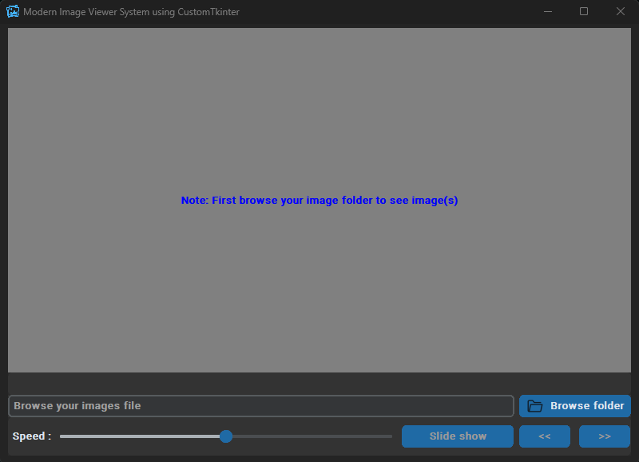
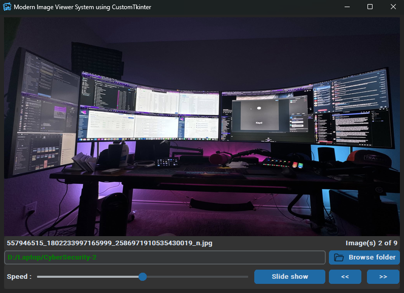

# 🖼️ Image Viewer

A modern **Image Viewer Application** built using **Python** and **CustomTkinter**, featuring a clean, dark-themed interface for viewing and browsing images effortlessly.


## 🌟 Overview

The **Image Viewer** lets users open, view and navigate through image files with an elegant and responsive graphical interface. Designed with **CustomTkinter**, it offers a professional look similar to native desktop applications — simple, intuitive and lightweight.


## ⚙️ Features

- 🖼️ Open and display images of multiple formats (`.jpg`, `.jpeg`, `.png`, `.bmp`, `.gif`)
- 📂 Browse and load multiple images from a folder
- ⏮️ Navigate between previous and next images
- 🌓 Modern dark/light theme support (CustomTkinter)
- 🪶 Lightweight, minimalistic, and responsive UI
- 💻 Cross-platform (Windows, macOS, Linux)


## 🧩 Tech Stack

### **Tkinter**
Tkinter is Python’s standard GUI library used for building cross-platform desktop applications.

### **CustomTkinter**
[CustomTkinter](https://github.com/TomSchimansky/CustomTkinter) extends Tkinter with:

- Modern, consistent design  
- Light & Dark themes  
- High-DPI scaling  
- Fully customizable modern widgets  

Together, they ensure a smooth UI experience on **Windows**, **macOS** and **Linux**.

| Component | Description |
|------------|--------------|
| **Language** | Python 3.x |
| **GUI Framework** | [CustomTkinter](https://github.com/TomSchimansky/CustomTkinter) |
| **Core Libraries** | Tkinter, Pillow (PIL) |


## 🧰 Installation

### Step 1. Clone the repository

```bash
git clone https://github.com/iamx-ariful-islam/Image-Viewer.git
cd Image-Viewer
```

### Step 2. Install Python Dependencies

The `requirements.txt` file, lists of all the Python libraries that "**_image viewer_**" depends on and installs those packages from the file:

```bash
pip install -r requirements.txt
# or
sudo pip install -r requirements.txt
```

### Step 3. Run the Application
```bash
python main.py
```


## 📂 Folder Structure
Here’s the structure of the **Image Viewer** project:

```bash
image-viewer/
│
├── screenshots/
├── main.py
│── LICENSE
├── README.md
└── requirments.txt
```


## 🖼️ Screenshots

Here are some screenshots of the `Image Viewer` project:

**Main Window**<br/>
<br/>
**Output - Main Window**<br/>



## 🤝 Contributing

Contributions, suggestions, and feedback are always welcome! ❤️<br/>
To contribute:

1. Fork the repository
2. Create a new branch (`feature/new-feature`)
3. Commit your changes
4. Push and submit a Pull Request

💬 You can also open an issue if you’d like to discuss a feature or report a bug.


## 🌐 For more or connect with me

<p align='center'>
  <a href="https://github.com/iamx-ariful-islam"></a>&nbsp;&nbsp;
  <a href="https://bd.linkedin.com/in/iamx-ariful-islam"></a>&nbsp;&nbsp;
  <a href="https://x.com/mx_ariful_islam"></a>&nbsp;&nbsp;
  <a href="https://www.facebook.com/iamx.ariful.islam/"></a>
</p>


## 📜 License

The [MIT](https://choosealicense.com/licenses/mit/) License (MIT)


## 💖 Thank You for Visiting!

> “Good design is about making things simple yet significant”  
> — *Md. Ariful Islam*